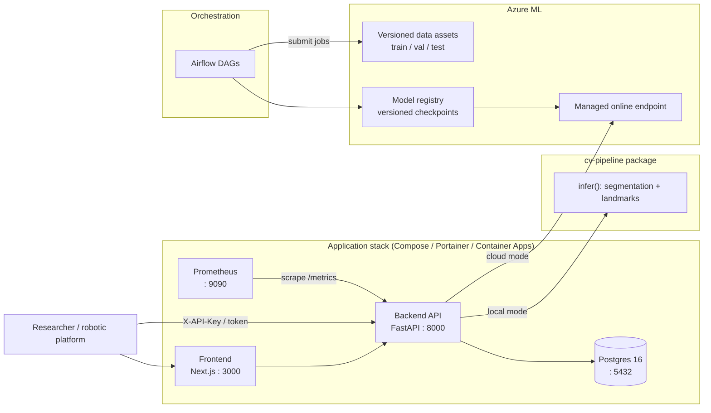
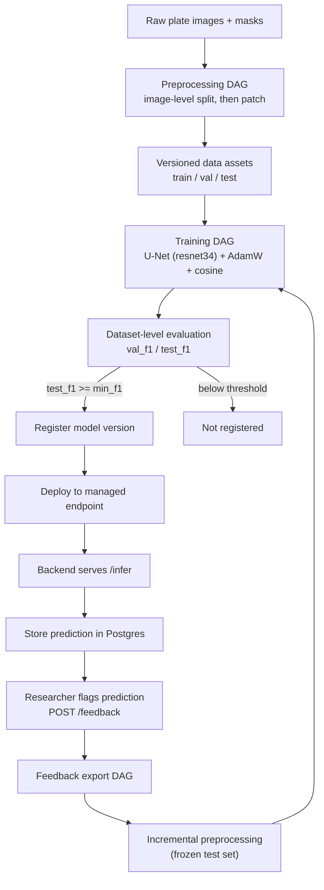

# CV Pipeline — Plant Phenotyping Platform

[](https://github.com/alex-krasnoshtanov/CV-Pipeline-Deployment-Platform/actions/workflows/ci.yml)
[](https://alex-krasnoshtanov.github.io/CV-Pipeline-Deployment-Platform/)
[](https://github.com/alex-krasnoshtanov/CV-Pipeline-Deployment-Platform/actions/workflows/cd.yml)
[](https://github.com/alex-krasnoshtanov/CV-Pipeline-Deployment-Platform/actions/workflows/images.yml)
[](https://www.python.org/downloads/)
[](LICENSE)

A computer-vision platform for plant organ segmentation and root-tip detection
on *Arabidopsis thaliana* seedling images — packaged as a library, served
behind an authenticated API, orchestrated by Airflow, and deployable to three
different targets (local, on-premise, Azure).

The interesting part of this repository is not the model. It is everything
around the model: the packaging boundary, the serving modes, the retraining
loop that closes on user feedback, and the fact that the same codebase deploys
to a laptop, a shared GPU server, and a managed cloud endpoint without a fork.

> **A five-person university group project** — Breda University of Applied
> Sciences, April to June 2026. The [Attribution](#attribution) section breaks
> authorship down per component, derived from the original repository's git
> history.

---

## Contents

- [What it does](#what-it-does)
- [System architecture](#system-architecture)
- [Model lifecycle](#model-lifecycle)
- [Quick start](#quick-start)
- [Data and model weights](#data-and-model-weights)
- [Repository layout](#repository-layout)
- [The `cv-pipeline` package](#the-cv-pipeline-package)
- [API](#api)
- [Authentication](#authentication)
- [Deployment targets](#deployment-targets)
- [Monitoring, drift and retraining](#monitoring-drift-and-retraining)
- [CI/CD](#cicd)
- [Testing](#testing)
- [Documentation](#documentation)
- [Attribution](#attribution)
- [Licence](#licence)
- [Author](#author)

---

## What it does

- **Segmentation + landmarks** — U-Net (ResNet-34 encoder) predicts root masks;
  a landmark stage derives root tips from the predicted mask.
- **Two serving modes from one codebase** — the backend either loads a local
  checkpoint or delegates to a remote scoring endpoint, chosen by environment
  variable. No code path is duplicated between them.
- **Explainability** — Seg-Grad-CAM heatmaps served from the same loaded model,
  so an explanation never needs a second weight download.
- **Feedback flywheel** — researchers flag bad predictions through the UI;
  flagged samples are exported, re-preprocessed against a frozen test set, and
  fed back into training.
- **Drift detection and alerting** — confidence distribution, latency and error
  rate are tracked against configurable thresholds and exposed to Prometheus.
- **Three deployment targets** — Docker Compose locally, Portainer on-premise,
  Azure Container Apps + Azure ML in the cloud.

---

## System architecture

The backend serves predictions either from a local model checkpoint or by
calling a remote managed endpoint, depending on configuration.



Per-environment diagrams (data pipeline, training pipeline, local, on-premise,
cloud) live in [`docs/architecture/`](docs/architecture/).

---

## Model lifecycle

Every arrow below is implemented as code — an Airflow DAG, an Azure ML job, or
a backend service.



**Why dataset-level F1.** `val_f1` and `test_f1` accumulate true and false
positives across the whole set and score once, rather than averaging per-batch
F1. Root patches are overwhelmingly background, and a per-batch average
collapses toward zero even for a strong model. See
[`train.py`](packages/cv-pipeline/src/cv_pipeline/train.py).

**Image-level splitting.** The train/val/test split happens *before* patching,
not after. Patches from one plate cannot leak across the split boundary, which
would otherwise inflate validation scores badly.

---

## Quick start

### Prerequisites

- Python 3.11
- [`uv`](https://docs.astral.sh/uv/) 0.5+
- Docker + Docker Compose

A GPU is not required. The workspace resolves CPU PyTorch wheels deliberately —
see [`pyproject.toml`](pyproject.toml) for why.

### Install

```bash
git clone https://github.com/alex-krasnoshtanov/CV-Pipeline-Deployment-Platform.git
cd CV-Pipeline-Deployment-Platform
uv sync
```

### Configure

```bash
cp configs/env/env.example configs/env/.env
```

Fill in every value marked `REQUIRED`. The compose stack refuses to start with
an unset required secret rather than falling back to a default — generate each
with `openssl rand -hex 32`.

### Run the full stack

```bash
cd infra/local
docker compose up --build
```

| Service | URL | Notes |
|---|---|---|
| Frontend | <http://localhost:3000> | Researcher UI |
| Backend API | <http://localhost:8000/docs> | OpenAPI / Swagger |
| Postgres | `localhost:5433` | Host 5433 → container 5432 |
| Prometheus | <http://localhost:9090> | Scrapes backend `/metrics` |

`docker compose down` stops everything; add `-v` to wipe volumes.

### Backend only, with reload

```bash
uv run uvicorn api.main:app \
    --reload --host 0.0.0.0 --port 8000 \
    --app-dir apps/backend/src
```

---

## Data and model weights

**Neither the dataset nor a trained checkpoint ships with this repository.**

The NPEC *Arabidopsis* plate dataset is not mine to redistribute, so it is
absent by design — `data/` contains only directory placeholders and a single
sample plate used in the documentation. The API, the CLI and the full test
suite all run without it.

Model weights resolve through a small registry in
[`weights.py`](packages/cv-pipeline/src/cv_pipeline/weights.py), which maps a
version string to a download URL and caches the result under
`~/.cache/cv-pipeline/models/`. Weights are published as GitHub Release assets:
the release endpoint streams raw bytes and needs no credentials on a public
repository.

The `unet-v1` checkpoint is published as the
[weights-v1](https://github.com/alex-krasnoshtanov/CV-Pipeline-Deployment-Platform/releases/tag/weights-v1)
release, 97.9 MB, and its SHA-256 is pinned in the registry, so a corrupted or
substituted download fails instead of loading a model that predicts nonsense.
Nothing needs configuring: the first call downloads and caches it.

To use a checkpoint of your own instead, point `MODEL_PATH` at it, or run the
backend against a remote endpoint with `MODEL_ENDPOINT_URL`. See
[add a new model version](docs/source/how-to/add-a-new-model-version.md) for the
publishing flow.

To train on your own data, arrange it as:

```
my_data/
├── train/
│   ├── images/
│   └── masks/
└── val/
    ├── images/
    └── masks/
```

then run `uv run cv-pipeline train --data-dir my_data/train --val-dir my_data/val`.

---

## Repository layout

```
.
├── apps/
│   ├── backend/                  FastAPI service
│   │   └── src/api/
│   │       ├── auth/             API keys, JWT, OAuth/OIDC, sessions, bcrypt
│   │       ├── db/               SQLAlchemy models, session, seed
│   │       ├── middleware/       Request ID + exception handlers
│   │       ├── routers/          auth, explain, feedback, health, infer,
│   │       │                     monitoring, stats, users
│   │       ├── schemas/          Pydantic request/response models
│   │       ├── services/         drift, endpoint client, explain, feedback,
│   │       │                     inference, storage, stats
│   │       └── metrics.py        Prometheus instrumentation
│   └── frontend/                 Next.js researcher UI
├── packages/
│   └── cv-pipeline/              Installable package: model, infer, train, CLI
├── infra/
│   ├── local/                    docker-compose.yml (4 services)
│   ├── server/                   Portainer on-premise stack
│   ├── monitoring/prometheus/    Prometheus image + scrape config
│   ├── cloud/
│   │   ├── train_environment/    Azure ML training image + registration
│   │   ├── training_jobs/        Manual training submission
│   │   └── endpoint/             Azure ML inference endpoint image
│   └── airflow/
│       ├── dags/                 8 orchestration DAGs
│       └── training_code/        Cloud preprocess + train entry points
├── scripts/azure/                Stage data, register env, deploy endpoint
├── configs/
│   ├── env/env.example           Environment template
│   └── model/                    Training defaults
├── docs/
│   ├── architecture/             Mermaid diagrams per environment
│   └── source/                   Sphinx documentation source
├── .github/workflows/            ci, docs, images, pr-title
├── pyproject.toml                uv workspace root
└── uv.lock
```

---

## The `cv-pipeline` package

`cv-pipeline` is a standalone installable library — it runs without a server,
a database, or a cloud account.

The design rule that shapes it: **the package never loads weights itself.** The
caller passes in a loaded model. That keeps the library free of any opinion
about where checkpoints live, which is what lets the same code back a CLI, a
FastAPI service, and an Azure ML scoring script without conditionals.

```bash
uv run cv-pipeline infer --image plate.png --output results/
uv run cv-pipeline train --data-dir data/train --val-dir data/val --epochs 50
```

| Module | Responsibility |
|---|---|
| `segmentation.py` | U-Net construction and mask prediction |
| `landmarks.py` | Root-tip extraction from a predicted mask |
| `infer.py` | Orchestrates segmentation → landmarks → result schema |
| `explain.py` | Seg-Grad-CAM heatmap generation |
| `train.py` | Training loop, dataset-level metrics, checkpointing |
| `preprocessing.py` | Patching, normalisation, split handling |
| `weights.py` | Version registry, download and cache |
| `schema.py` | Typed result contract shared with the API |
| `validation.py` | Input and mask validation |

---

## API

| Method | Path | Purpose |
|---|---|---|
| `GET` | `/health` | Liveness plus model-readiness state |
| `POST` | `/infer` | Segment an uploaded image, persist the prediction |
| `POST` | `/explain` | Seg-Grad-CAM heatmap for an image |
| `POST` | `/feedback` | Flag a prediction as incorrect |
| `GET` | `/stats` | Aggregate prediction statistics |
| `GET` | `/monitoring` | Drift and alert state |
| `*` | `/auth/*` | Login, OAuth callback, session lifecycle |
| `*` | `/users/*` | User administration |
| `GET` | `/metrics` | Prometheus exposition |

Full generated reference:
[`docs/source/reference/backend-api.md`](docs/source/reference/backend-api.md).

Every error response carries a stable machine-readable code — see
[error codes](docs/source/explanation/error-codes.md). `MODEL_NOT_READY` (503)
is returned while the lifespan handler is still loading the model, rather than
failing an inference request with a generic 500.

---

## Authentication

Four mechanisms, layered:

- **API keys** — bcrypt-hashed, for programmatic and robotic-platform clients.
- **Email + password** — bcrypt, for human researchers.
- **GitHub OAuth** — via Authlib, with an independently signed state cookie.
- **JWT sessions** — short-TTL signed tokens for browser sessions.

Credentialed CORS is enforced with an explicit origin allow-list; `*` is
rejected rather than silently permitted, because browsers refuse wildcard
origins on credentialed requests anyway.

See [security model](docs/source/explanation/security-model.md).

---

## Deployment targets

| Target | Orchestration | Notes |
|---|---|---|
| **Local** | Docker Compose | Four services, self-contained, no cloud dependency |
| **On-premise** | Portainer on a shared GPU server | Images pulled from GHCR, Traefik ingress |
| **Cloud** | Azure Container Apps + Azure ML | Managed online endpoint serves the model |

Architecture notes per target:
[local](docs/architecture/deployment-local.md) ·
[on-premise](docs/architecture/deployment-on-premise.md) ·
[cloud](docs/architecture/deployment-cloud.md)

The local stack is deliberately *not* wired to read the shared
`configs/env/.env` wholesale. Its compose file declares an explicit allow-list
of variables, so a cloud-only setting such as `MODEL_ENDPOINT_URL` cannot leak
in and silently flip local inference into remote mode.

---

## Monitoring, drift and retraining

Prometheus scrapes the backend's `/metrics`. On top of the raw counters the
backend evaluates four configurable alert conditions:

| Threshold | Default | Meaning |
|---|---|---|
| `ALERT_CONFIDENCE_MIN` | 0.60 | Floor for an individual prediction |
| `ALERT_LOW_CONF_FRACTION` | 0.20 | Share of low-confidence predictions tolerated |
| `ALERT_LATENCY_P95_MS` | 5000 | p95 inference latency ceiling |
| `ALERT_ERROR_RATE` | 0.05 | Error-rate ceiling |

`RETRAIN_FEEDBACK_THRESHOLD` (default 50) governs when accumulated feedback
triggers the retraining DAG.

---

## CI/CD

| Workflow | Trigger | Does |
|---|---|---|
| `ci.yml` | push / PR to main | Ruff lint + format check, pytest with 85% coverage gate, frontend lint/test/build |
| `cd.yml` | push to main | Builds and pushes three images, Trivy scan, on-premise deploy, smoke test, OIDC auth check, Container Apps rollout |
| `images.yml` | PR / version tag | Proves all three Dockerfiles still build; publishes semver-tagged images from a tag |
| `deploy-endpoint.yml` | manual | Redeploys the Azure ML scoring endpoint |
| `docs.yml` | docs or source changes | Generates OpenAPI markdown, builds Sphinx, publishes it to Pages from main |
| `pr-title.yml` | PR | Enforces conventional-commit PR titles, except Dependabot's |

Image publishing authenticates with the built-in `GITHUB_TOKEN`. GHCR was
chosen over Docker Hub specifically so that half of the pipeline needs no
repository secrets, and the cloud half needs none either because it
authenticates through OIDC federated credentials rather than a stored client
secret.

**The two deploy chains are gated and currently skipped.** They targeted a
Portainer host on the university campus network and the university's Azure
subscription, and neither exists now, so both sit behind an `ENABLE_DEPLOY`
repository variable. Everything before them runs on every push.

They did run. [`docs/delivery/`](docs/delivery/) documents each gate and
[`docs/evidence/`](docs/evidence/) holds captured output, including a
4,086-line transcript of one full run and a health capture showing the cloud
apps on their nineteenth revision, serving, with the model loaded.

---

## Testing

```bash
uv run pytest -m unit                    # fast unit suite
uv run ruff check . && uv run ruff format --check .
cd apps/frontend && npm run test:ci      # vitest
```

Currently **430 unit tests, 92.6% line coverage** across `cv_pipeline` and
`api`, with CI failing below 85%.

---

## Documentation

**The documentation site is at [alex-krasnoshtanov.github.io/CV-Pipeline-Deployment-Platform](https://alex-krasnoshtanov.github.io/CV-Pipeline-Deployment-Platform/)**
— tutorials, how-to guides, the API reference generated from the OpenAPI
schema, and autoapi across both packages.

[`docs/delivery/`](docs/delivery/) is the pipeline: federated cloud auth,
approval gates, the post-deploy smoke test, the Container Apps rollout, and
metrics. [`docs/evidence/`](docs/evidence/) holds the captured runs behind it.
[`docs/cost-analysis.md`](docs/cost-analysis.md) prices the cloud tier.

Sphinx sources in [`docs/source/`](docs/source/), organised on the
[Diátaxis](https://diataxis.fr/) split — tutorials, how-to guides, reference,
explanation. Build locally:

```bash
uv sync --group docs
uv run scripts/generate_openapi_docs.py
cd docs && make html
```

---

## Attribution

This is group work by five people. The numbers below are **surviving lines**:
`git blame -w` over the final tree of the original repository, so each row
answers "whose lines are in the code that shipped" rather than "who typed the
most at some point". Rewrites, reverts and churn do not inflate it.

Generated and captured files are excluded. Lockfiles alone are 18,744 lines,
and counting them would credit whoever last ran `npm install` with 8,533.

| Component | Lines | Oleksii | Filipp | Danil | Maksym | Marin |
|---|---:|---:|---:|---:|---:|---:|
| `packages/cv-pipeline` | 6,841 | 21% | **76%** | 3% | — | — |
| `apps/backend` | 12,672 | **42%** | 40% | 18% | — | — |
| `apps/frontend` | 6,391 | **45%** | — | 15% | 39% | — |
| `infra/airflow` | 4,413 | 31% | **68%** | <1% | — | — |
| `infra/cloud` | 502 | 32% | **68%** | — | — | — |
| `infra/monitoring` | 130 | **100%** | — | — | — | — |
| `infra/server` | 103 | **97%** | 3% | — | — | — |
| `scripts/azure` | 1,789 | **57%** | 36% | 8% | — | — |
| `.github/workflows` | 900 | **61%** | 3% | 33% | 2% | <1% |
| **All code** | **33,741** | **39%** | **42%** | **12%** | **7%** | **<1%** |

Rows are rounded and may not total exactly 100%; a further 72 lines across the
tree came from a GitHub Copilot agent.

**Marin's contribution is not in that table.** It is in documentation: of the
original repository's 7,912 documentation lines, Danil wrote 41%, Oleksii 31%,
Filipp 14% and Marin 13%. The docs in *this* repository are substantially
rewritten, so those lines mostly do not appear here.

**In plain terms:** I led the delivery and operations surface — CI/CD,
container images, the on-premise and monitoring stacks, and the Azure
provisioning scripts. On the backend and the frontend I am the largest single
contributor, but narrowly: 42% against Filipp's 40%, and 45% against Maksym's
39%. The `cv-pipeline` package, the Airflow DAGs and the Azure ML layer were
predominantly Filipp's; I worked in all three and led none of them. Across all
code the split between the two of us is 42/39 in his favour.

Original team: Oleksii Krasnoshtanov, Filipp Lotsmanov, Danil Sysenko,
Maksym Steshkin, Marin Chiosa.

### How to read this, and how not to

Lines are a poor proxy for contribution. They reward whoever wrote the verbose
parts, and a table like this cannot see design decisions, review, or the
debugging that leaves no lines behind. Treat it as a rough shape.

Commits tell a different story, and the disagreement is the useful part. Across
449 commits I authored 249, opened 59 pull requests of which all 59 merged, and
reviewed 43 of other people's. But on `packages/cv-pipeline` the commit counts
are near-level — Filipp 14 to my 13 — while the lines are 76% to 21%. He wrote
the large modules; I made many small changes to them. Neither number alone says
that, which is why both are here.

The [original repository](https://github.com/BredaUniversityADSAI/2025-26d-fai2-adsai-group-suicidesquad7)
is private and on a university account, so the history these numbers come from
— every commit, pull request and review — is not publicly readable. The method
is stated above so the figures can at least be argued with.

---

## Licence

[MIT](LICENSE).

The work is jointly authored by five people. A co-author has published the same
codebase under MIT at
[filipp-lotsmanov/root-inoculation-mlops](https://github.com/filipp-lotsmanov/root-inoculation-mlops),
so this repository matches that rather than offering a different set of terms
for the same code.

The NPEC *Arabidopsis* plate dataset is not covered by the licence and is not
included here.

---

## Author

**Oleksii (Alex) Krasnoshtanov** — [@alex-krasnoshtanov](https://github.com/alex-krasnoshtanov)
