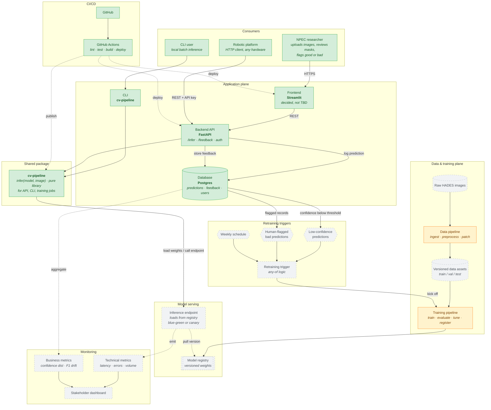

# High-Level Component Architecture

> **⚠️ Superseded — Sprint-1 design snapshot (last updated 2026-04-17).**
> Current architecture lives in [`system.md`](system.md), [`deployment.md`](deployment.md), and [`mlops.md`](mlops.md); refer to those for the state of `main`.
> This draft predates work that has since shipped: the frontend migrated from **Streamlit** to **Next.js** (port 3000) on 2026-05-30; pipeline orchestration is implemented as **Airflow DAGs** in `infra/airflow/dags/` (running Azure ML training jobs), not an "Azure ML pipeline"; and confidence/drift monitoring shipped on `main` (Prometheus `/metrics` via `apps/backend/src/api/metrics.py`, rolling-confidence drift in `apps/backend/src/api/services/drift_detector.py`). The component labels and ✅ Built / 🟡 Planned statuses below reflect the original Sprint-1 design, not current `main`.

> **Scope:** Logical components of the CV pipeline deployment and how they talk to each other.
> This view is environment-agnostic — local, on-premise, and cloud deployments all run the
> same components. Per-environment deployment diagrams are tracked separately.
>
> **Status:** Sprint 1 draft · owner: Krasnoshtanov, Alex · last updated: 2026-04-17
>
> **Implementation status:** ✅ Built — code exists and is wired · 🟠 Partial — exists but incomplete or unconfirmed · 🟡 Planned — drawn only, no implementing code

---

## Diagram

## Implementation Status

| Component | Status | Evidence |
|---|---|---|
| NPEC researcher | ✅ Built | `apps/frontend/` — Streamlit UI deployed |
| CLI user | ✅ Built | `packages/cv-pipeline/src/cv_pipeline/cli.py` |
| Robotic platform | ✅ Built | `apps/backend/src/api/routers/infer.py` — API key auth |
| Frontend (Streamlit) | ✅ Built | `apps/frontend/` — deployed via `cd.yml` |
| Backend API (FastAPI) | ✅ Built | `apps/backend/src/api/` — `/infer`, `/feedback`, auth routers |
| Database (Postgres) | ✅ Built | `apps/backend/src/api/db/models.py` — predictions/feedback/users tables |
| CLI (cv-pipeline) | ✅ Built | `packages/cv-pipeline/src/cv_pipeline/cli.py` |
| cv-pipeline package | ✅ Built | `packages/cv-pipeline/src/cv_pipeline/` |
| GitHub / GitHub Actions | ✅ Built | `.github/workflows/ci.yml`, `.github/workflows/cd.yml` |
| Data pipeline | 🟠 Partial | `scripts/prepare_data.py` — local data-prep script; no AML-orchestrated pipeline |
| Training pipeline | 🟠 Partial | `scripts/azure/train.py` — MLflow wrapper around `cv_pipeline.train`; no AML pipeline |
| Model registry | 🟡 Planned | No AML workspace; zero `azure.ai.ml` imports in codebase |
| Inference endpoint | 🟡 Planned | No AML managed online endpoint provisioned |
| Raw HADES images (datastore) | 🟡 Planned | No Azure Blob datastore configured |
| Versioned data assets | 🟡 Planned | No AML data-asset registration |
| Retraining triggers | 🟡 Planned | Feedback stored in DB; no trigger/orchestration logic built |
| Technical metrics | 🟡 Planned | No App Insights integration |
| Business metrics | 🟡 Planned | No Azure Monitor custom metrics |
| Stakeholder dashboard | 🟡 Planned | Not built |

---

## Notes on what this shows

The diagram groups components by **logical role**, not by where they run. The same
containers and package run in all three deployment targets (local, on-premise Portainer,
Azure); only config changes. Per-environment diagrams live in separate files.

**The `cv-pipeline` package is the only place that knows how to run inference given a loaded model.** Weight loading is the caller's responsibility. In local and on-prem, the backend loads weights from a volume on startup. In cloud, the Azure ML endpoint handles weight loading. The backend never contains weights directly.

**Model weights are never baked into the container image** once cloud deployment is live.
The `cv-pipeline` package does not load weights itself. The backend loads weights from a volume at startup for local and on-prem runs, while the Azure ML endpoint owns weight loading in cloud. Rolling out a new model version does not require rebuilding the backend image.

**The retraining trigger has three independent sources** — any one of them fires the
pipeline:

1. **Low confidence** — when the fraction of predictions below 0.60 (configurable via `ALERT_CONFIDENCE_MIN`) exceeds 20% over a 1-hour window, that is a drift signal.
2. **Human feedback** — researchers review the original image + predicted mask in the
   frontend and flag it as good or bad. Enough bad flags trigger retraining.
3. **Weekly schedule** — a baseline cadence so the model never goes stale even when
   nobody flags anything.

This matches real-world MLOps patterns (data flywheel) while reflecting our context:
a trained expert is looking at every output anyway, so their judgement is the highest-
quality retraining signal we can get. Low-confidence auto-flagging is the safety net
for the cases humans do not see.

**Monitoring has two independent pipes.** Technical metrics (latency, errors, request
volume) are emitted by the inference endpoint itself. Business metrics (confidence
distribution, F1 drift) are aggregated from predictions and feedback in the database.
Both feed the same stakeholder dashboard. This split matters because the two metric
families have different owners — SREs care about latency, NPEC cares about F1.

## What this diagram deliberately does not show

- **Deployment environments.** The split between `docker compose` local, Portainer
  on-prem, and Azure cloud is tracked in the three deployment diagrams.
- **Which Azure service implements each box.** That also belongs in the cloud deployment
  diagram (Azure Container Apps vs. Azure ML managed endpoint vs. App Service is a
  deployment concern, not a component one).
- **Data pipeline internals.** The detailed steps inside `Data pipeline` (image decoding,
  Petri dish extraction, patch generation, datastore registration) are in the data
  pipeline diagram.
- **Training pipeline internals.** Same — hyperparameter tuning, conditional
  registration logic, and experiment tracking live in the training pipeline diagram.

## How to edit this file

GitHub renders Mermaid inside markdown natively — the diagram above will render in a
normal PR view on `github.com`. For local editing in VS Code, install the
**Markdown Preview Mermaid Support** extension and open the preview pane.

Changes to this diagram must be paired with changes to the corresponding deliverables
(`package_plan.md`, CV pipeline spec, later deployment diagrams). If a component is
added or removed here it should be added or removed there too.