# Data Pipeline

> **⚠️ Historical design document (2026-04-17).**
> Current architecture lives in [`system.md`](system.md), [`deployment.md`](deployment.md), and [`mlops.md`](mlops.md); refer to those for the state of `main`.
> This is the original design, kept because the reasoning behind it is still the reasoning the system runs on. Several details changed during implementation: the frontend moved from **Streamlit** to **Next.js** (port 3000); orchestration is **Airflow DAGs** in `infra/airflow/dags/` submitting Azure ML jobs, not an "Azure ML pipeline"; and confidence/drift monitoring shipped (Prometheus `/metrics` via `apps/backend/src/api/metrics.py`, rolling-confidence drift in `apps/backend/src/api/services/drift_detector.py`). The ✅ Built / 🟡 Planned labels below reflect the design as drafted, not the final state.

> **Scope:** How raw HADES images become versioned training, validation, and test data
> assets in Azure ML. Covers the three trigger sources (scheduled, new-data, feedback)
> and the preprocessing steps between raw storage and registered assets.
>
> **Out of scope:** Training, model evaluation, model registration — those live in the
> training pipeline diagram. Inference-time data flow (API requests, live predictions)
> is in the high-level component diagram.
>
> **Status:** Original design draft, 2026-04-17.
>
> **Implementation status:** ✅ Built — code exists and is wired · 🟠 Partial — exists but incomplete or unconfirmed · 🟡 Planned — drawn only, no implementing code

---

## Data Pipeline Architecture

```mermaid
flowchart LR
    %% ============ TRIGGERS ============
    subgraph Triggers["Triggers"]
        direction TB
        sched["Weekly schedule<br/><i>cron</i>"]
        newdata["New data landing<br/><i>blob event</i>"]
        fb["Feedback threshold<br/><i>N flagged records</i>"]
    end

    orchestrator(["Pipeline orchestrator<br/><b>Azure ML pipeline</b>"])
    sched --> orchestrator
    newdata --> orchestrator
    fb --> orchestrator

    %% ============ SOURCES ============
    subgraph Sources["Sources"]
        direction TB
        raw[("Raw HADES images<br/><b>Blob · datastore</b><br/><i>.tif · metadata sidecar</i>")]
        opdb[("Operational DB<br/><i>flagged predictions<br/>with corrected masks</i>")]
    end

    %% ============ PIPELINE STAGES ============
    subgraph Stages["Pipeline stages"]
        direction LR
        list["1 · List files<br/><i>enumerate new blobs<br/>read metadata</i>"]
        gate["2 · Early gate<br/><i>extension · file size<br/>header bytes</i>"]
        decode["3 · Decode + validate<br/><i>resolution · bit depth<br/>colour mode</i>"]
        pair["4 · Pair labels<br/><i>match corrected masks<br/>to source images</i>"]
        extract["5 · Extract dish<br/><i>crop Petri dish<br/>region</i>"]
        patch["6 · Patch<br/><i>fixed-size tiles<br/>for U-Net</i>"]
        split["7 · Split<br/><i>train / val / test<br/>grouped by plate</i>"]
        register["8 · Register<br/><i>new asset version<br/>in Azure ML</i>"]
        list --> gate --> decode --> pair --> extract --> patch --> split --> register
    end

    %% ============ SINKS ============
    subgraph Sinks["Outputs"]
        direction TB
        train[("train_vN")]
        val[("val_vN")]
        test[("test_vN")]
        rejects[("Rejected images<br/><i>quarantine +<br/>error log</i>")]
        unmatched[("Unmatched labels<br/><i>corrections without<br/>source image</i>")]
        manifest[("Run manifest<br/><i>source hashes<br/>row counts · timing</i>")]
    end

    %% ============ WIRING ============
    raw --> list
    opdb -->|corrected labels| pair
    orchestrator -->|kicks off| list

    gate -.->|fails header/size| rejects
    decode -.->|fails resolution/mode| rejects
    pair -.->|no matching image| unmatched

    register --> train
    register --> val
    register --> test
    register --> manifest

    %% ============ DOWNSTREAM ============
    train -.->|consumed by| downstream["Training pipeline"]
    val -.->|consumed by| downstream
    test -.->|consumed by| downstream

    %% ============ STYLING ============
    classDef trigger fill:#FBEAF0,stroke:#993556,color:#4B1528
    classDef orch fill:#EEEDFE,stroke:#534AB7,color:#26215C
    classDef source fill:#E1F5EE,stroke:#0F6E56,color:#04342C
    classDef stage fill:#FAEEDA,stroke:#854F0B,color:#412402
    classDef sink fill:#E6F1FB,stroke:#185FA5,color:#042C53
    classDef ext fill:#F1EFE8,stroke:#5F5E5A,color:#2C2C2A,stroke-dasharray: 3 3

    class sched,newdata,fb trigger
    class orchestrator orch
    class raw,opdb source
    class list,gate,decode,pair,extract,patch,split,register stage
    class train,val,test,rejects,unmatched,manifest sink
    class downstream ext

    %% ============ IMPLEMENTATION STATUS ============
    classDef built fill:#d4edda,stroke:#28a745,color:#155724
    classDef partial fill:#fff3cd,stroke:#fd7e14,color:#7a3e00
    classDef planned fill:#f1f3f5,stroke:#adb5bd,color:#495057,stroke-dasharray: 5 5

    class opdb built
    class downstream partial
    class sched,newdata,fb,orchestrator,raw,list,gate,decode,pair,extract,patch,split,register planned
    class train,val,test,rejects,unmatched,manifest planned
```

## Implementation Status

| Component | Status | Evidence |
|---|---|---|
| Operational DB (flagged predictions) | ✅ Built | `apps/backend/src/api/db/models.py` — feedback/predictions tables |
| Training pipeline (downstream) | 🟠 Partial | `scripts/azure/train.py` — MLflow wrapper; no AML-orchestrated pipeline |
| Pipeline triggers (schedule / blob event / feedback threshold) | 🟡 Planned | No AML pipeline or scheduler configured |
| Pipeline orchestrator (Azure ML pipeline) | 🟡 Planned | No AML workspace; zero `azure.ai.ml` imports in codebase |
| Raw HADES images (Azure Blob datastore) | 🟡 Planned | No Azure Blob datastore configured |
| Pipeline stages (list → register) | 🟡 Planned | `scripts/prepare_data.py` exists locally; no AML pipeline job |
| Versioned data assets (train/val/test vN) | 🟡 Planned | No AML data-asset registration |
| Run outputs (rejects / unmatched / manifest) | 🟡 Planned | Not built |

---

## What this diagram shows

The pipeline is a single orchestrated workflow in Azure ML (or Airflow — tooling choice is in the implementation plan, not here) with three entry points:

1. **Weekly schedule.** Baseline cadence so the training set is never older than a week. This guarantees a refresh even if nothing else triggers a run.
2. **New data event.** A HADES batch lands in the raw datastore → the pipeline runs only on the new files. This is the happy path for incremental production use.
3. **Feedback threshold.** Researchers flag predictions as bad in the frontend; each flag gets stored in the operational DB along with the corrected mask. Once enough flags accumulate, the pipeline runs and folds those corrected pairs into the next training version. This is what makes the system a data flywheel.

All three triggers enter the same eight-stage pipeline, so there is only one preprocessing implementation to maintain — the trigger only changes *what* is processed, not *how*.

## The eight stages, and why each one exists

To optimize compute and make data joins explicit, the initial ingestion and validation steps are broken down into distinct stages:

1. **List files** — enumerate the new blobs that this run needs to process and read their metadata. This separates the lightweight listing operation from the heavy downloading phase.
2. **Early gate** — perform cheap, surface-level checks (file extension, file size, header bytes). Rejected files are caught here before wasting compute on expensive downloads and decoding.
3. **Decode + validate** — download the files and run deep acceptance checks defined in the [CV pipeline specification](../source/reference/specification.md): resolution, bit depth, and colour mode. 
4. **Pair labels** — an explicit join step. When the pipeline is triggered by feedback, this stage matches the corrected masks from the operational DB to their original source images. 
5. **Extract dish** — HADES plate photos contain non-dish regions (trays, markers, reflections). Cropping to the dish region before patching prevents the model from learning artefacts outside the biology.
6. **Patch** — the U-Net operates on fixed-size tiles, not full-resolution plates. Consistent patch size and stride is what makes train and inference inputs comparable.
7. **Split** — train/val/test assignment happens at **plate level**, not patch level. Two patches from the same plate are highly correlated; if one is in train and one is in val, the validation score is inflated. Grouping by plate prevents this leakage.
8. **Register** — write the three sets to the datastore and register a new versioned data asset in Azure ML (`train_v3`, `val_v3`, `test_v3` if the last run produced v2). Old versions are retained so that every registered model can be re-trained from its exact source data.

## What gets written per run

A successful run produces six artefacts:

- `train_vN`, `val_vN`, `test_vN` — the new versioned data assets.
- `Rejected images` — images that failed the Early Gate or Decode + Validate stages, stored in quarantine with their error codes. A sudden spike is a quality-monitoring signal that HADES has changed or the spec needs loosening.
- `Unmatched labels` — corrected masks pulled from the operational DB that could not be successfully joined to a source image. 
- `Run manifest` — source file hashes, row counts per split, per-stage timing, git SHA of the pipeline code. This is the reproducibility record — combined with the asset version, it is enough to reconstruct any past training run.

## What this diagram deliberately does not show

- **Tooling choice.** Azure ML pipeline vs. Airflow vs. something else — the diagram is agnostic; any industry-standard orchestrator satisfies it. The decision lives in the package plan.
- **Compute topology.** Which steps run on which cluster, parallelism, scaling — belongs in the cloud deployment diagram.
- **Training steps.** What happens once `train_vN` is consumed — in the training pipeline diagram.
- **Data lineage graph.** Which model version trained on which data version — tracked in Azure ML automatically, not drawn here.

## Capability coverage
| Capability | Where it is visible |
|---|---|
| Cloud data storage | `Raw HADES images` and output assets are datastore-backed |
| Versioned data assets | `Register` stage produces `_vN` suffixed assets |
| Data management through code | `List files` → `Register` is entirely code-driven, no manual UI step |
| Preprocessing converted to a pipeline | Eight-stage DAG inside the `Pipeline stages` subgraph |
| Scheduled or triggered runs | Three trigger sources in the `Triggers` band |

## How to edit

Same as the high-level architecture diagram: Mermaid inside markdown renders on GitHub natively and in VS Code via the Markdown Preview Mermaid Support extension. If a stage is added, removed, or renamed here, the corresponding change must also appear in the package plan and the data pipeline YAML/SDK code.