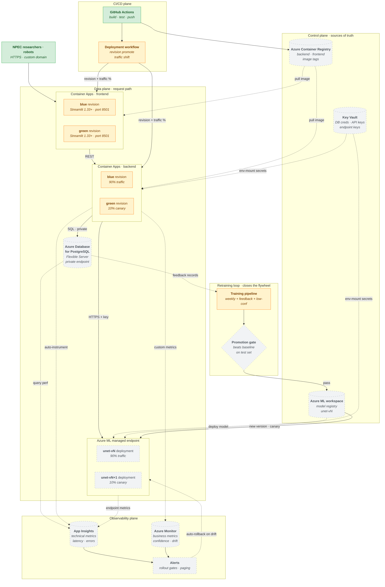

# Azure Cloud Deployment

> **⚠️ Superseded — Sprint-1 design snapshot (last updated 2026-04-17).**
> This is the Sprint-1 design for the Azure production target. Current deployment state lives in [`deployment.md`](deployment.md): the backend and frontend are **deployed and Running on Azure Container Apps**, and on-prem Portainer is also live — see [`system.md`](system.md) and [`mlops.md`](mlops.md) for the rest.
> This draft also predates the frontend migration from **Streamlit** to **Next.js** (port 3000) on 2026-05-30, so the "Streamlit 1.33+" revision boxes below name the retired stack. The Azure-native services in the diagram (ACR, Azure ML endpoint, App Insights, Azure Monitor) remain **planned**, not built.

> **Scope:** How the same three containers from local and on-prem run as managed
> Azure services, with native blue/green deployment at two independent layers
> (backend revisions and model endpoint traffic splitting), managed Postgres,
> secrets, monitoring, and the retraining loop closing the MLOps cycle.
>
> **Out of scope:** Local (workstation) and on-premise (Portainer) deployments are
> previous diagrams. This is the production target.
>
> **Design principle:** Reuse every pattern from on-premise that can be reused.
> Ingress-via-reverse-proxy becomes Container Apps ingress. Weights-from-registry
> stays identical. Internal-only database stays identical. What changes is which
> services run the pattern, and how scaling and deployment automation work.
>
> **Status:** Sprint 1 draft · owner: Krasnoshtanov, Alex · last updated: 2026-04-17
>
> **Implementation status:** ✅ Built — code exists and is wired · 🟠 Partial — exists but incomplete or unconfirmed · 🟡 Planned — drawn only, no implementing code

---

## Diagram

## Implementation Status

| Component | Status | Evidence |
|---|---|---|
| NPEC researchers / robots | ✅ Built | Backend API deployed with API key + session auth |
| GitHub Actions (CI/CD) | ✅ Built | `.github/workflows/ci.yml`, `.github/workflows/cd.yml` |
| Frontend Container Apps revisions (blue/green) | 🟠 Partial | `cd.yml` `deploy-azure` job + canary traffic split wired; bootstrap (`scripts/azure/create_container_apps.py`) written; apps not yet live (pending bootstrap with real secrets) |
| Backend Container Apps revisions (blue/green) | 🟠 Partial | Same as above |
| Deployment workflow (revision + traffic shift) | ✅ Built | `cd.yml` `deploy-azure` — multiple-revision mode + 10% canary split after every image update; promote command in job notice |
| Training pipeline | 🟠 Partial | `scripts/azure/train.py` — MLflow wrapper exists locally; no AML-orchestrated pipeline |
| AML managed endpoint deployments (unet-vN canary) | 🟡 Planned | No AML workspace; zero `azure.ai.ml` imports in codebase |
| Azure Database for PostgreSQL (managed) | 🟡 Planned | Docker Postgres used in local/on-prem; no managed PostgreSQL provisioned |
| Azure Container Registry (ACR) | 🟡 Planned | GHCR (`ghcr.io`) used instead of ACR in all workflows |
| Azure ML workspace / model registry | 🟡 Planned | No AML workspace; zero `azure.ai.ml` imports in codebase |
| Key Vault | 🟡 Planned | Secrets passed via GitHub environment secrets/vars; no Key Vault integration |
| App Insights | 🟡 Planned | No App Insights SDK or instrumentation in `apps/backend/` |
| Technical monitoring (Prometheus) | ✅ Built | `prometheus-fastapi-instrumentator` wired in `main.py`; `/metrics` exposes HTTP request rate, latency, error rate + `cv_inference_confidence` histogram (model-quality signal). Prometheus, not App Insights — same rubric coverage, no billable Azure service. |
| Azure Monitor custom metrics | 🟡 Planned | Not built |
| Alerting + auto-rollback | 🟡 Planned | Not built |
| Promotion gate (conditional model registration) | 🟡 Planned | Not built |

---

## What this diagram shows

Five planes, each with a clear responsibility:

1. **Data plane** — where user requests actually flow. Frontend revisions serve the
   UI, backend revisions handle API routes and business logic, the Azure ML endpoint
   serves model inference, Postgres stores predictions and feedback.
2. **Control plane** — the sources of truth that the data plane pulls from at
   deployment time: container registry for images, Azure ML workspace for model
   weights, Key Vault for secrets.
3. **Observability plane** — App Insights for technical metrics, Azure Monitor for
   business metrics, alerts fan out to humans and to auto-rollback logic.
4. **CI/CD plane** — GitHub Actions builds images and triggers deployments. This is
   the same source as on-prem; what changes is the target.
5. **Retraining loop** — training pipeline produces a new model, promotion gate
   decides whether to register it, new version rolls into the endpoint as a canary.
   This is what closes the MLOps flywheel.

The diagram deliberately mirrors the structure of the on-premise diagram so the
rehearsal pattern is visible: Container Apps replaces Portainer, Azure ML endpoint
replaces the GPU-pool selection, App Insights replaces Portainer UI logs, Key Vault
replaces `.env`, ACR replaces GitHub Container Registry.

## Two independent blue/green mechanisms — the critical design choice

This is the single most important thing about Azure cloud deployment that is not
obvious until you build it. There are **two independent** blue/green rollout
mechanisms operating at different layers:

**Backend blue/green** (at the Container Apps layer). Container Apps supports
multiple revisions with configurable traffic percentages. Deploying a new backend
image creates a new revision; the deployment workflow shifts traffic from blue to
green over a few minutes. If App Insights alerts fire, traffic is rolled back to
blue automatically. This handles changes to API code, preprocessing logic,
validation, auth — anything that is not the model itself.

**Model endpoint blue/green** (at the Azure ML endpoint layer). Azure ML managed
endpoints support multiple deployments behind the same endpoint URL, also with
configurable traffic percentages. Registering `unet-vN+1` creates a second
deployment; traffic percentage shifts from the old to the new. The backend does not
know which version it is hitting — it calls the endpoint URL, the endpoint routes by
percentage. This handles changes to the model itself.

**Why this matters:** model updates (every week, plus feedback-triggered) are far
more frequent than backend code updates. Coupling them — where every new model
version requires a new backend release — would be both slow and risky. Splitting
them means the retraining pipeline can promote models independently of the
engineering team's code release cycle. The backend is essentially a stable API
layer in front of a constantly-updating model.

### The canary shapes in the diagram

The `90% / 10%` split on both rows is the same rollout percentage but for completely
independent reasons. A new backend revision starts at 10% and grows to 100% over
minutes if healthy. A new model version starts at 10% and grows to 100% over hours
or days as confidence metrics prove it out. These cadences are not the same.

## Service selection rationale

| Component | Azure service | Why this one |
|---|---|---|
| Frontend hosting | Container Apps | Scale-to-zero for off-hours cost; native revisions for blue/green |
| Backend hosting | Container Apps | Same image as on-prem; handles bursts via auto-scale |
| Model inference | Azure ML managed endpoint | Native model-registry integration; native traffic splitting; GPU SKUs; per-deployment autoscale |
| Database | Azure DB for PostgreSQL Flexible | Same Postgres everywhere; managed patching and backup |
| Container images | Azure Container Registry | Native Container Apps integration; geo-replication if needed |
| Model registry | Azure ML workspace | Already used by data and training pipelines; no duplication |
| Secrets | Key Vault | Native Container Apps secret mounting; no app-code secrets |
| Technical metrics | App Insights | Auto-instrumentation for FastAPI; near-zero setup |
| Business metrics | Azure Monitor custom metrics | Backend logs `confidence`, `F1 drift` explicitly |
| Ingress | Container Apps built-in | TLS auto-provisioned; custom domain supported; no separate gateway needed for Sprint 4 scope |

**Explicitly not chosen:**

- **AKS (Kubernetes).** Powerful but overkill for this scope. Container Apps gives
  blue/green, autoscale, ingress, and revision management without the operator
  burden of running a cluster.
- **App Service.** Works for the backend but does not integrate with the model
  registry the way an ML endpoint does, and we would lose the clean blue/green
  split.
- **Cosmos DB.** Different data model from local/on-prem Postgres — introducing a
  storage divergence across environments for no gain.
- **Functions for inference.** Cold-start latency and GPU support are both worse than
  a managed endpoint with `min_replicas=1`.
- **Front Door.** Nice-to-have for geo-distribution; not required for Sprint 4.

## The retraining loop closing

This is where the six diagrams stitch into one system. Follow the loop:

1. Users upload images → predictions logged to Postgres, some flagged as bad.
2. Feedback accumulation in the DB crosses a threshold → training pipeline fires.
3. Training pipeline produces a candidate, evaluates it on the test set, compares
   against the current production model.
4. Promotion gate passes → new `unet-vN+1` registered in Azure ML workspace.
5. Deployment workflow creates a new endpoint deployment using the new version at
   10% traffic.
6. Monitoring watches the 10% for drift, confidence distribution, error rate over
   some hours or days.
7. If healthy, traffic shifts to 100% on the new version; the old deployment is
   marked for deletion.
8. If alerts fire, traffic rolls back to 0% on the new version; the old stays at
   100%; a human investigates.

The full MLOps story — versioned data, versioned models, blue/green rollout,
monitoring-driven rollback, feedback-driven retraining — is exactly this loop. Every
arrow in the retraining band of the diagram corresponds to one machine-readable
event flowing between services.

## Secrets and config

No `.env` file in the cloud. Container Apps mounts Key Vault secrets directly as
environment variables, so the application code sees the same env var contract as
local and on-prem but never touches a file. The secret names are identical across
environments (`DB_URL`, `API_KEY`, `MODEL_ENDPOINT_URL`, `MODEL_ENDPOINT_KEY`) so
the backend does not have environment-aware branches. What it reads changes by
source, not by name.

The Key Vault itself is reached through Container Apps' managed identity — no
secret for the secret store. If the managed identity is revoked, every container
loses access simultaneously, which is the correct failure mode.

## Observability — what App Insights gets for free and what we log explicitly

**For free with auto-instrumentation** (one line in the FastAPI app):

- Request rate, latency percentiles (p50/p95/p99), error rate per endpoint
- Dependency call traces (DB, Azure ML endpoint) with their own latency and error
  metrics
- Failed request exception stack traces
- Liveness and readiness probe outcomes
- Container Apps revision metadata on every request (which revision served it)

**Custom metrics from backend code**:

- Per-prediction confidence score (distribution over time = drift signal)
- Per-prediction model version (ties metrics to a specific `unet-vN`)
- User feedback rate (flagged / total predictions)
- F1 score computed nightly on feedback-corrected records

The split matters because the free metrics cover ILO 9.5D "technical metrics" fully,
while the custom metrics cover "business metrics" and the drift detection that
triggers auto-rollback. You want both; they do not substitute for each other.

## Cost control — sketch only

Full analysis is ILO 4.4B and lives in a separate cost report. The diagram-level
decisions that keep cost bounded:

- **Scale-to-zero on frontend.** NPEC researchers do not use the tool 24/7. Off-hours
  cost is near zero.
- **Minimum 1 replica on backend and endpoint.** Keeps cold start out of the user
  path during work hours; scales up automatically under load.
- **Small SKU for Postgres Flexible Server.** The prediction/feedback workload is
  tiny by managed-DB standards.
- **Azure ML endpoint on a single GPU VM.** Scale-up for heavy load is automatic
  but capped in the endpoint config.
- **Log retention 30 days.** App Insights default is 90; dropping to 30 cuts storage
  cost and is enough for Sprint 5 demo and post-mortem.

## What this diagram deliberately does not show

- **VNet, private endpoints, NSGs.** A real production deployment would put the DB
  behind a private endpoint and scope network access tightly. For Sprint 4 scope,
  Container Apps built-in access to Azure services through managed identity is
  sufficient; the diagram flags Postgres as "private endpoint" to nod at this
  without diagramming the full network layer.
- **Front Door / WAF.** Not required for the brief.
- **Disaster recovery, geo-replication, backup schedules.** Operational concerns
  beyond scope.
- **Cost breakdown per service.** ILO 4.4B report.
- **Exact Azure ML endpoint SKU.** Decision that depends on the Block B model's
  inference profile and is tuned during Sprint 4.
- **Training pipeline internals.** That is a separate diagram; here it appears only
  as the loop-closing producer.
- **Individual GitHub Actions job steps.** CI/CD workflow files are where that
  detail lives.

## How this supports ILO 9.5 evidence

| Rubric item | Where it is visible |
|---|---|
| Deploy registered models as endpoints (9.5C) | Azure ML managed endpoint box with model versions |
| Model versioning and rollback (9.5C) | Two model deployments with traffic % on endpoint |
| Integrate endpoint into application (9.5C) | Backend → ML endpoint arrow |
| Appropriate deployment strategies (9.5C) | Blue/green at two layers, canary traffic percentages |
| Automated deployment (9.5C) | CI/CD plane → revision + traffic shift arrows |
| Automated retraining (9.5D) | Retraining loop band, feedback → training → registry → endpoint |
| Technical monitoring (9.5D) | App Insights auto-instrumentation |
| Business monitoring (9.5D) | Azure Monitor custom metrics |
| Automated rollout decisions (9.5D) | Alerts → auto-rollback arrow on endpoint |

## How to edit

Mermaid inside markdown. When the deployment workflow or service selection changes,
the corresponding box here changes along with the IaC (Bicep/Terraform) and the
Azure DevOps runbook. These three must stay consistent — a change to one without
the others means the diagram is lying.