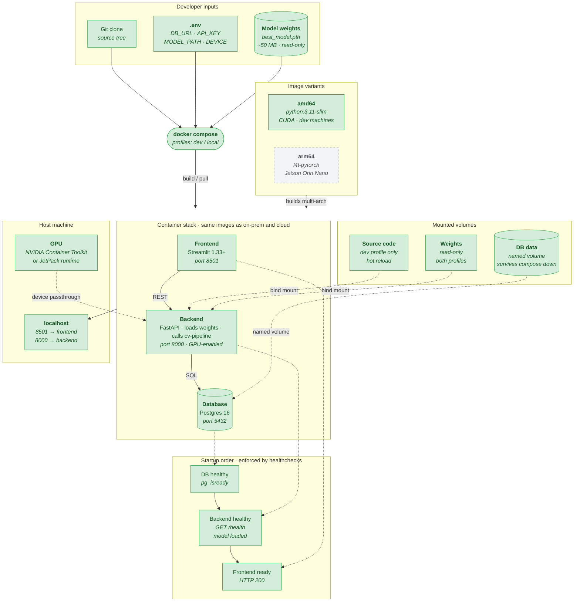

# Local Deployment

> **⚠️ Superseded — Sprint-1 design snapshot (last updated 2026-04-17).**
> Current architecture lives in [`system.md`](system.md), [`deployment.md`](deployment.md), and [`mlops.md`](mlops.md); refer to those for the state of `main`.
> This draft predates work that has since shipped: the frontend migrated from **Streamlit** to **Next.js** (port 3000) on 2026-05-30; pipeline orchestration is implemented as **Airflow DAGs** in `infra/airflow/dags/` (running Azure ML training jobs), not an "Azure ML pipeline"; and confidence/drift monitoring shipped on `main` (Prometheus `/metrics` via `apps/backend/src/api/metrics.py`, rolling-confidence drift in `apps/backend/src/api/services/drift_detector.py`). The component labels and ✅ Built / 🟡 Planned statuses below reflect the original Sprint-1 design, not current `main`.

> **Scope:** How the three containers (backend, frontend, database) run on a developer
> machine or edge device, with the same images that run on-premise and in the cloud.
> Two modes: `dev` (hot reload, source mounted) and `local` (built images, production-
> like). Covers GPU exposure, model-weights-as-volume, healthcheck chain, and the
> multi-arch path for ARM64 edge hardware (Jetson Orin Nano).
>
> **Out of scope:** On-premise Portainer and Azure cloud deployments are separate
> diagrams. This one is deliberately the simplest of the three — it is the baseline
> the other two diverge from.
>
> **Target hardware range:** x86_64 dev machines with NVIDIA consumer GPUs (RTX 3060
> 12 GB through RTX 5070 12 GB) and ARM64 edge devices (Jetson Orin Nano 8 GB). Apple
> Silicon and CPU-only machines are supported through fall-back paths.
>
> **Status:** Sprint 1 draft · owner: Krasnoshtanov, Alex · last updated: 2026-04-17
>
> **Implementation status:** ✅ Built — code exists and is wired · 🟠 Partial — exists but incomplete or unconfirmed · 🟡 Planned — drawn only, no implementing code

---

## Diagram



## Implementation Status

| Component | Status | Evidence |
|---|---|---|
| Git clone / source tree | ✅ Built | Root of repository |
| `.env` file | ✅ Built | `apps/backend/src/api/config.py` — env var contract documented |
| Model weights volume | ✅ Built | `infra/local/docker-compose.yml` — `vwts` bind-mount |
| docker compose orchestration | ✅ Built | `infra/local/docker-compose.yml` — dev + local profiles |
| Frontend (Streamlit) | ✅ Built | `apps/frontend/` |
| Backend (FastAPI) | ✅ Built | `apps/backend/` |
| Database (Postgres 16) | ✅ Built | `infra/local/docker-compose.yml` |
| Source / weights / DB volumes | ✅ Built | `infra/local/docker-compose.yml` — named volumes + bind mounts |
| GPU passthrough | ✅ Built | `infra/local/docker-compose.yml` — nvidia device reservation |
| localhost port exposure | ✅ Built | `infra/local/docker-compose.yml` — ports 8501/8000 |
| Healthcheck chain (DB → backend → frontend) | ✅ Built | `infra/local/docker-compose.yml` — `depends_on: condition: service_healthy` |
| amd64 image variant | ✅ Built | `apps/backend/Dockerfile` — python:3.11-slim base |
| arm64 (Jetson Orin Nano) variant | 🟡 Planned | No arm64 / l4t-pytorch Dockerfile path or buildx multi-arch config |

---

## What this diagram shows

Three containers come up under `docker compose`, same images that run everywhere else,
with four things glued to them from the host: environment variables, model weights,
source code (dev mode only), and GPU access. Healthchecks enforce startup order so that
the frontend never tries to call a backend whose model has not finished loading.

The key design claim is that **nothing in the containers is specific to local**. Every
environment-dependent choice — where the DB lives, which GPU to use, which model
version to load, whether hot reload is on — comes from the `.env` file or the compose
profile. Switching to on-premise or cloud changes that config, not the images.

## The two profiles

Compose is used with named profiles so the same file describes two modes:

- **`dev`** — source tree bind-mounted into the backend container, `uvicorn --reload`
  watches for changes, saves you a rebuild on every edit. Use this while writing code.
- **`local`** — built image, no source mount, no reload. This is the production-like
  path. Use this to validate that what ships actually works. If a bug only reproduces
  in `local`, it is probably a Dockerfile / dependency issue that will also hit on-prem.

```bash
docker compose --profile dev up      # fast iteration
docker compose --profile local up    # production-like
```

## Efficiency decisions worth calling out

Five choices that separate a local deployment that takes 5 seconds per inference from
one that takes 40.

### 1 · Model weights as a read-only volume, not baked into the image

Weights are 50+ MB and change every retraining cycle. Baking them into the image means
rebuilding and re-pushing every new model version, which is slow and wastes storage.
Mounting them instead means one image, many weights, and on-prem and cloud can mount
their own version of the same file. The backend reads `MODEL_PATH` from `.env` — for
local it points to the bind mount, for cloud it will point to Azure Blob.

### 2 · Model loaded once at startup, not per request

The backend container loads the checkpoint in a FastAPI startup event and stores the
model on a module-level singleton. It then passes this model object to
`cv-pipeline.infer()` on each request. First request after `compose up` is slow (weights
load + first CUDA kernel compile). Every subsequent request hits the already-warm model.
This is why the backend healthcheck tests `GET /health` — it only reports healthy after
the model is in memory, so the frontend never serves a pre-warm request.

### 3 · GPU exposure with explicit compose config

NVIDIA Container Toolkit on the host plus this in the compose file:

```yaml
deploy:
  resources:
    reservations:
      devices:
        - driver: nvidia
          count: 1
          capabilities: [gpu]
```

If this block is missing or the toolkit is not installed, the container silently falls
back to CPU and inference drops from ~1 s to ~30 s. The diagram shows this as the GPU
passthrough arrow — it is not optional for 256 × 256 patch inference with 50 %
overlap on a full HADES plate.

The `DEVICE` env var lets the backend fall back to CPU cleanly when no GPU is present
(laptop without NVIDIA, Apple Silicon dev machine), so the stack works everywhere; it
is just slow without acceleration.

### 4 · Healthcheck chain prevents startup-order bugs

`depends_on` with `condition: service_healthy` is the difference between reliable and
flaky local deployments. Without it, the frontend can race ahead of the backend and
the first user request fails with a 502 that looks like a code bug.

```yaml
frontend:
  depends_on:
    backend: { condition: service_healthy }
backend:
  depends_on:
    db: { condition: service_healthy }
  healthcheck:
    test: ["CMD", "curl", "-f", "http://localhost:8000/health"]
    interval: 10s
    start_period: 30s   # generous — model load takes time
```

The generous `start_period` on the backend is important: the first GPU kernel compile
can take 20+ seconds and during that window `/health` should not report healthy.

### 5 · Named volume for database data

`db_data` as a named volume means `compose down` leaves the data intact. `compose down
-v` is the deliberate way to wipe everything. This matches real-world behaviour: taking
a service down for maintenance should not destroy its state.

## Jetson Orin Nano path

The edge device story is what makes this project actually interesting versus a
straight "three Docker containers" exercise. Three concrete differences from x86_64:

| Aspect | Dev machine (3060 / 5070) | Jetson Orin Nano |
|---|---|---|
| Architecture | amd64 | arm64 |
| Base image | `python:3.11-slim` + CUDA | `nvcr.io/nvidia/l4t-pytorch` |
| GPU runtime | NVIDIA Container Toolkit | JetPack L4T runtime |
| VRAM / memory | 12 GB discrete | 8 GB shared (unified) |
| Power | 170 – 250 W | 7 – 15 W |
| Inference acceleration | FP32 default | TensorRT FP16 / INT8 |

**Multi-arch build with `docker buildx`** is the clean way to handle this. One
`Dockerfile` with arch-conditional logic, published as two manifests under the same
tag (`backend:1.0.0`). The host pulls whichever matches. No per-device compose files.

**TensorRT conversion on first start, cached to a volume.** On Jetson, converting the
ResAttentionUNet from PyTorch to TensorRT FP16 takes 1 – 2 minutes once and saves it to
`/models/cache/`. Subsequent starts are instant. This alone is the difference between
~3 s and ~0.8 s inference on an Orin Nano for a full HADES plate. The diagram treats
the cache as a named volume for this reason.

**Memory pressure.** Patch-based inference at 256 × 256 with 50 % overlap on a
4096 × 4096 plate produces ~256 forward passes. Batch size must drop from the dev-
machine default of 16 down to 2 or 4 on Orin Nano, or the unified memory fills up and
the kernel starts swapping. `BATCH_SIZE` is an env var for this reason.

## What this diagram deliberately does not show

- **Dockerfile internals.** Multi-stage build layers, apt packages, poetry vs uv —
  all in `apps/backend/Dockerfile`. Not a deployment-diagram concern.
- **Compose YAML details.** Service names, network names, exact healthcheck commands
  live in `compose.yaml`. The diagram shows the pattern, not the syntax.
- **Code inside the containers.** That is the component diagram and the package plan.
- **How model weights got onto the machine.** On dev machines they are downloaded
  manually or pulled from Azure via the CLI. On Jetson they ship with the device
  image. The upstream source is the model registry — that is a cloud-deployment
  concern.
- **The Azure ML endpoint.** Local deployment does inference locally from the mounted
  weights file. It does not call a cloud endpoint, deliberately — so the developer can
  work offline and so the cloud is not hit on every test run.

## How this supports the ILO 9.5A evidence

| Rubric item | Where it is visible |
|---|---|
| Deploy an inference pipeline using industry-standard tools | Docker Compose, 3-container stack |
| Interact with a deployed model locally | `localhost:8501` frontend, `localhost:8000/docs` API |
| Inference works end-to-end | Image in → mask + confidence out, under 5 s on dev GPU |
| Containerised | Each container has its own Dockerfile, no local installs needed |
| Single command from clean clone | `docker compose --profile local up` |

## How to edit

Mermaid inside markdown. Renders on GitHub natively and in VS Code via the Markdown
Preview Mermaid Support extension. When the `compose.yaml` or environment contract
changes, update the relevant box in this diagram and the env var list in the package
plan simultaneously — those two documents must stay consistent.