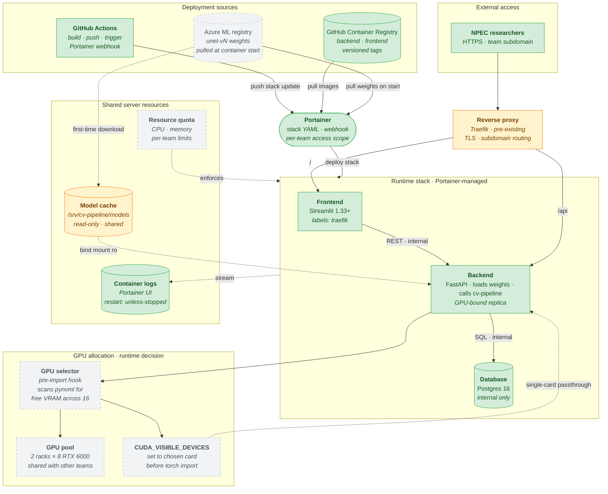

# On-Premise Deployment

> **⚠️ Superseded — Sprint-1 design snapshot (last updated 2026-04-17).**
> Current architecture lives in [`system.md`](system.md), [`deployment.md`](deployment.md), and [`mlops.md`](mlops.md); refer to those for the state of `main`.
> This draft predates work that has since shipped: the frontend migrated from **Streamlit** to **Next.js** (port 3000) on 2026-05-30; pipeline orchestration is implemented as **Airflow DAGs** in `infra/airflow/dags/` (running Azure ML training jobs), not an "Azure ML pipeline"; and confidence/drift monitoring shipped on `main` (Prometheus `/metrics` via `apps/backend/src/api/metrics.py`, rolling-confidence drift in `apps/backend/src/api/services/drift_detector.py`). The component labels and ✅ Built / 🟡 Planned statuses below reflect the original Sprint-1 design, not current `main`.

> **Scope:** How the same three containers from the local deployment run on the shared
> BUas Linux server managed through Portainer. Covers the deployment path from CI to
> Portainer, GPU auto-selection across the 16-card GPU pool, reverse-proxy ingress,
> and model-weight distribution from the Azure ML registry.
>
> **Out of scope:** Local deployment (previous diagram) and Azure cloud deployment
> (next diagram). This one sits in the middle — further from local than a rebadge,
> closer to a rehearsal for cloud.
>
> **Target host:** Shared BUas server, Threadripper CPU, two racks with 8 RTX 6000
> cards per rack (16 total), multi-team tenancy, Portainer as the web-facing Docker
> orchestrator, reverse proxy already provisioned on the host.
>
> **Status:** Sprint 1 draft · owner: Krasnoshtanov, Alex · last updated: 2026-04-17
>
> **Implementation status:** ✅ Built — code exists and is wired · 🟠 Partial — exists but incomplete or unconfirmed · 🟡 Planned — drawn only, no implementing code

---

## Diagram



## Implementation Status

| Component | Status | Evidence |
|---|---|---|
| GitHub Container Registry (GHCR) | ✅ Built | `.github/workflows/cd.yml` — `docker/build-push-action` → `ghcr.io` |
| GitHub Actions CI/CD | ✅ Built | `.github/workflows/cd.yml` — build, push, and `deploy-portainer` job |
| Portainer stack deployment | ✅ Built | `.github/workflows/cd.yml` `deploy-portainer` job — webhook to `<portainer-host>:<webhook-port>` |
| Frontend / Backend / Database containers | ✅ Built | `infra/server/docker-compose.portainer.yml` |
| Container logs (Portainer UI) | ✅ Built | Portainer stack — stdout captured by Docker |
| NPEC researchers (access) | ✅ Built | API and frontend deployed on-premise |
| Reverse proxy (Traefik) | 🟠 Partial | Traefik labels in `infra/server/docker-compose.portainer.yml`; actual subdomain routing depends on BUas server admin config |
| Model weight cache | 🟠 Partial | `infra/server/docker-compose.portainer.yml` — local volume mount; AML weight download not implemented |
| Azure ML registry (weight source) | 🟡 Planned | No AML workspace; zero `azure.ai.ml` imports in codebase |
| GPU auto-selector (`pynvml` pre-import hook) | 🟡 Planned | No GPU selector code in `apps/backend/`; described in docs only |
| GPU pool / `CUDA_VISIBLE_DEVICES` pinning | 🟡 Planned | Same as above |
| Per-team resource quota | 🟡 Planned | Server-admin concern; not in our codebase |

---

## What this diagram shows

The runtime stack is still the three containers from local deployment, but everything
around them is different because it is a shared multi-tenant environment. Four layers
wrap the containers:

1. **Deployment sources** — images and weights come from remote registries, not the
   developer's laptop.
2. **Portainer** — the stack is managed through a web UI and a webhook, not
   `docker compose up`.
3. **Reverse proxy** — users reach the frontend and backend through a subdomain, not
   a port number.
4. **Host resources** — GPU pool, shared model cache, logs, and quotas live outside
   the stack but touch it.

The Dockerfiles do not change. The application code does not change. The compose-style
stack definition in Portainer is almost identical to `compose.yaml`. What changes is
how the stack is summoned, where its inputs come from, and how users reach it.

## GPU auto-selection — the part you flagged specifically

With 16 shared cards across two racks, a fixed `CUDA_VISIBLE_DEVICES=0` means every
team's backend fights for card 0. The fix is to pick the least-loaded card at
container start.

The pattern is a short script that runs before any `import torch`, queries per-card
free VRAM through NVML, picks the card with the most free memory, and sets the env
var. Because CUDA_VISIBLE_DEVICES is consumed at torch-import time, the script must
execute first — either as a shell wrapper, or as the first lines of the entrypoint
Python file.

```python
# entrypoint.py — top of file, before any ML imports
import os
from pynvml import nvmlInit, nvmlDeviceGetHandleByIndex, nvmlDeviceGetMemoryInfo, nvmlDeviceGetCount

nvmlInit()
best_idx, best_free = 0, 0
for i in range(nvmlDeviceGetCount()):
    free = nvmlDeviceGetMemoryInfo(nvmlDeviceGetHandleByIndex(i)).free
    if free > best_free:
        best_idx, best_free = i, free
os.environ["CUDA_VISIBLE_DEVICES"] = str(best_idx)

# only now import anything that touches CUDA
import torch
```

Two things to note. First, the container must be launched with access to *all* GPUs
so the selector can see them, but after selection torch will only see the one chosen.
Second, the selection is at startup, not per-request — the container holds its card
for its lifetime. This is acceptable because RTX 6000 has 48 GB and the
ResAttentionUNet plus inference activations sit comfortably under 4 GB. The
"wasted" capacity is actually useful: another team picking a card also sees yours as
partially free and will likely pick elsewhere, approximating fair allocation.

Alternatives considered and rejected for Sprint 2 scope:

- **`nvidia.com/gpu` device plugin with resource requests.** Cleaner but needs
  Kubernetes; Portainer on plain Docker does not expose this.
- **Round-robin from a coordinator service.** Needs shared state between teams;
  over-engineered.
- **Manual rotation through config.** Human in the loop, no thanks.

The pre-import hook is the simplest thing that works, does not require coordination,
and produces near-optimal placement in the common case.

## Deployment path — how code and weights arrive on the host

Two parallel paths:

**Image distribution.** GitHub Actions builds `backend` and `frontend` images on every
push to `main`, tags them with the commit SHA and a semantic version, pushes to
GitHub Container Registry. After a successful push, Actions calls the Portainer
webhook for the stack, which pulls the new images and restarts the containers. This
is the CD piece of ILO 9.5B — no human SSH, no manual pull, no "it works on my
machine but not on the server."

**Weight distribution.** When the backend container starts, it checks its local model
cache at `/models/` (bind-mounted from `/srv/cv-pipeline/models/` on the host). If
the required `MODEL_VERSION` is not present, it pulls from the Azure ML registry and
writes to cache. On subsequent restarts the weights are already there. This mirrors
what the cloud deployment will do and keeps on-prem offline-tolerant after the first
pull.

The `/srv/cv-pipeline/models/` directory is **shared across the team's stack
replicas** and **read-only from the container side**. Multiple backend replicas
(if we ever scale horizontally) pull weights once between them rather than N times.
Read-only enforcement prevents an accidental write from corrupting cached weights.

## Reverse proxy and ingress

The BUas server already runs Traefik (or equivalent) as the single ingress point for
all teams. We do not deploy our own proxy. Instead, the frontend and backend
containers carry Traefik labels:

```yaml
labels:
  - "traefik.enable=true"
  - "traefik.http.routers.cv-frontend.rule=Host(`<public-hostname>`)"
  - "traefik.http.routers.cv-backend.rule=Host(`<public-hostname>`) && PathPrefix(`/api`)"
  - "traefik.http.services.cv-backend.loadbalancer.server.port=8000"
```

Traefik auto-discovers the containers through the Docker socket, terminates TLS at
the subdomain, and routes `/` to the frontend and `/api/*` to the backend. The
database has no labels and no published ports — it is reachable only from inside the
stack network. Users never address the database; the backend does, over the internal
Docker network using the service name (`db:5432`).

This is what "multi-user and secure access" (R9) means at the deployment layer: TLS
at the edge, auth at the backend (API key from `.env`), database unreachable from
outside the stack.

## On-prem differences from local

| Concern | Local | On-premise |
|---|---|---|
| Orchestrator | `docker compose up` | Portainer stack + webhook |
| Image source | Local build | GitHub Container Registry |
| Weights source | Bind-mounted file | Azure ML registry → shared cache |
| User access | `localhost:8501` | `https://<public-hostname>` via Traefik |
| GPU selection | Fixed (single card) | Auto-selected from 16-card pool |
| Restart policy | Manual | `unless-stopped` |
| Logs | Terminal stdout | Portainer UI |
| Tenancy | Single user | Shared server, per-team quota |
| DB persistence | Named local volume | Named volume on shared disk |

The containers are identical. Everything else is configuration.

## Efficiency decisions specific to on-premise

Five choices that matter on a shared server in ways they did not on local:

### 1 · GPU auto-selection before torch imports

Already covered above. Saves real time in aggregate across teams and keeps your
inference predictable. Five lines of Python with `pynvml`.

### 2 · Weights cached once, read-only from containers

First backend start on a new model version downloads from Azure ML (several seconds).
Every subsequent start reads from the local cache instantly. A weight pull budget of
"one download per registered model version per server" is the goal. Read-only
mounting prevents any container from writing to the cache accidentally.

### 3 · Restart policy `unless-stopped`, not `always`

If the stack is deliberately stopped through Portainer, it stays stopped. If it
crashes, it restarts. `always` would fight a deliberate shutdown, which is annoying
when something is actually wrong and you want to investigate.

### 4 · Internal-only database

Postgres has no published port on the host. The backend reaches it by service name
on the internal Docker network (`db:5432`). This keeps ILO 9.5A's "secure access"
requirement honest — no one can reach the DB directly from the campus network, even
if they guess credentials.

### 5 · Logs routed to Portainer, not stdout-only

Portainer's per-container log view is the default debugging surface for on-prem.
Backend and frontend log through Python's `logging` module to stdout, Docker captures
it, Portainer surfaces it. If a proper log aggregator (Loki, ELK) is already
available on the server, a later sprint can plug into it through a Docker logging
driver without touching the app code.

## What this diagram deliberately does not show

- **Exactly which reverse proxy.** Traefik is the most likely given Docker label
  support, but the server team owns that choice. The diagram would not change if it
  were nginx-with-docker-gen or Caddy.
- **CI/CD internals.** GitHub Actions job steps, webhook authentication, and image
  signing belong in a CI/CD diagram or in the Actions workflow files.
- **Per-team quota values.** CPU shares, memory limits, GPU allocation policy are
  set by the BUas sysadmin and subject to change.
- **Inference logic or package structure.** Component diagram.
- **The cloud endpoint.** The on-prem backend does inference locally from cached
  weights. It does not call out to the Azure ML endpoint — that would defeat the
  point of on-prem deployment and introduce a latency-and-availability dependency on
  the cloud.

## How this supports the ILO 9.5A, 9.5B, and 9.5D evidence

| Rubric item | Where it is visible |
|---|---|
| On-premise deployment on Portainer | `Portainer` orchestrator in the diagram |
| Inference interactable on on-premise | Reverse proxy → frontend and backend paths |
| Automated deployment | `GitHub Actions` → Portainer webhook → stack update |
| Version control on deployment | Image tags from GHCR, `MODEL_VERSION` env var |
| Secure access | Traefik TLS, internal-only DB, per-team subdomain |
| Monitoring surface | Portainer logs, container healthchecks |

## How to edit

Same as the other four architecture diagrams: Mermaid inside markdown, renders on
GitHub and in VS Code via Markdown Preview Mermaid Support. When the stack YAML or
Traefik labels change on the server, update the relevant box here and the deployment
runbook together.