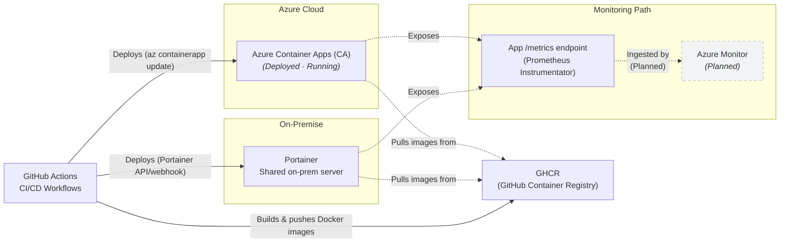

# Deployment Topology

This diagram illustrates the deployment topology from GitHub Actions to the final targets, and the monitoring path.

```mermaid
flowchart LR
    %% Deployment Topology
    github["GitHub Actions<br/>CI/CD Workflows"]
    ghcr["GHCR<br/>(GitHub Container Registry)"]
    
    subgraph OnPremise [On-Premise]
        portainer["Portainer<br/>Shared on-prem server"]
    end
    
    subgraph Cloud [Azure Cloud]
        azureca["Azure Container Apps (CA)<br/><i>(Deployed · Running)</i>"]
    end
    
    github -- "Builds & pushes Docker images" --> ghcr
    github -- "Deploys (Portainer API/webhook)" --> portainer
    github -- "Deploys (az containerapp update)" --> azureca
    
    portainer -. "Pulls images from" .-> ghcr
    azureca -. "Pulls images from" .-> ghcr
    
    subgraph Monitoring [Monitoring Path]
        metrics["App /metrics endpoint<br/>(Prometheus Instrumentator)"]
        azuremon["Azure Monitor<br/><i>(Planned)</i>"]
    end
    
    portainer -. "Exposes" .-> metrics
    azureca -. "Exposes" .-> metrics
    metrics -. "Ingested by<br/>(Planned)" .-> azuremon
    
    classDef planned fill:#f1f3f5,stroke:#adb5bd,stroke-dasharray: 5 5
    class azuremon planned
```
