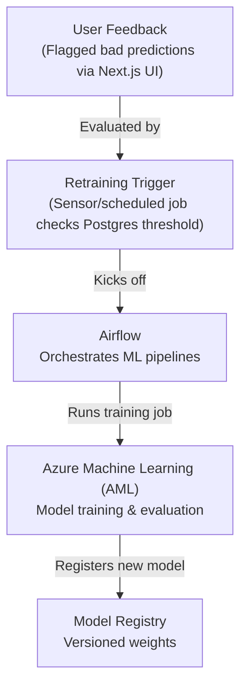

# MLOps Retraining Loop

This diagram illustrates the automated retraining loop for the CV pipeline.

```mermaid
flowchart TD
    %% MLOps Loop
    feedback["User Feedback<br/>(Flagged bad predictions via Next.js UI)"]
    trigger["Retraining Trigger<br/>(Sensor/scheduled job checks Postgres threshold)"]
    airflow["Airflow<br/>Orchestrates ML pipelines"]
    aml["Azure Machine Learning (AML)<br/>Model training & evaluation"]
    registry["Model Registry<br/>Versioned weights"]
    
    feedback -- "Evaluated by" --> trigger
    trigger -- "Kicks off" --> airflow
    airflow -- "Runs training job" --> aml
    aml -- "Registers new model" --> registry
```
