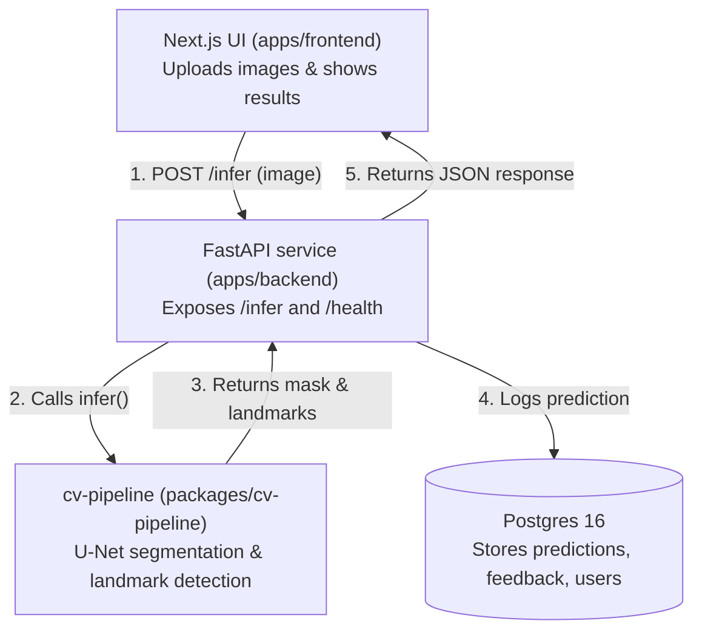

# System Architecture

This diagram illustrates the actual data flow of the CV pipeline.

```mermaid
flowchart TD
    %% System Architecture Data Flow
    frontend["Next.js UI (apps/frontend)<br/>Uploads images & shows results"]
    backend["FastAPI service (apps/backend)<br/>Exposes /infer and /health"]
    model["cv-pipeline (packages/cv-pipeline)<br/>U-Net segmentation & landmark detection"]
    db[("Postgres 16<br/>Stores predictions, feedback, users")]
    
    frontend -- "1. POST /infer (image)" --> backend
    backend -- "2. Calls infer()" --> model
    model -- "3. Returns mask & landmarks" --> backend
    backend -- "4. Logs prediction" --> db
    backend -- "5. Returns JSON response" --> frontend
```
