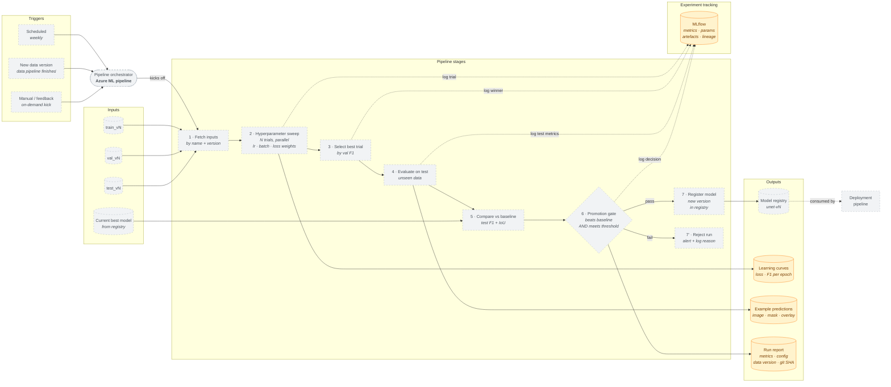

# Model Training Pipeline

> **⚠️ Superseded — Sprint-1 design snapshot (last updated 2026-04-17).**
> Current architecture lives in [`system.md`](system.md), [`deployment.md`](deployment.md), and [`mlops.md`](mlops.md); refer to those for the state of `main`.
> This draft predates work that has since shipped: the frontend migrated from **Streamlit** to **Next.js** (port 3000) on 2026-05-30; pipeline orchestration is implemented as **Airflow DAGs** in `infra/airflow/dags/` (running Azure ML training jobs), not an "Azure ML pipeline"; and confidence/drift monitoring shipped on `main` (Prometheus `/metrics` via `apps/backend/src/api/metrics.py`, rolling-confidence drift in `apps/backend/src/api/services/drift_detector.py`). The component labels and ✅ Built / 🟡 Planned statuses below reflect the original Sprint-1 design, not current `main`.

> **Scope:** How versioned data assets become a registered, production-grade model.
> Covers the three trigger sources, hyperparameter sweep, evaluation against a held-out
> test set, baseline comparison, and the conditional registration gate.
>
> **Out of scope:** Data preprocessing is in the data pipeline diagram. Model rollout
> to a serving endpoint is in the cloud deployment diagram. Live inference is in the
> high-level component diagram.
>
> **Based on:** The `ResAttentionUNet` training code from Block B (`Task 5/train.py`),
> adapted for orchestration, experiment tracking, and conditional registration.
>
> **Status:** Sprint 1 draft · owner: Krasnoshtanov, Alex · last updated: 2026-04-17
>
> **Implementation status:** ✅ Built — code exists and is wired · 🟠 Partial — exists but incomplete or unconfirmed · 🟡 Planned — drawn only, no implementing code

---

## Diagram

## Implementation Status

| Component | Status | Evidence |
|---|---|---|
| MLflow (experiment tracking) | 🟠 Partial | `scripts/azure/train.py` — logs params/metrics/artifacts locally; no confirmed AML workspace run |
| Learning curves / example predictions / run report | 🟠 Partial | `scripts/azure/train.py` generates artifacts locally; no AML pipeline run |
| Pipeline triggers (schedule / new data / manual) | 🟡 Planned | No AML pipeline or scheduler configured |
| Pipeline orchestrator (Azure ML pipeline) | 🟡 Planned | No AML workspace; zero `azure.ai.ml` imports in codebase |
| Versioned data inputs (train/val/test vN) | 🟡 Planned | No AML data-asset registration |
| Baseline model from registry | 🟡 Planned | No AML model registry |
| Pipeline stages (fetch → register/reject) | 🟡 Planned | No AML pipeline job; `cv_pipeline.train.train()` runs locally only |
| Hyperparameter sweep | 🟡 Planned | No AML sweep job configured |
| Promotion gate (conditional registration) | 🟡 Planned | No automated gate logic |
| Model registry (unet-vN) | 🟡 Planned | No AML model registry |
| Deployment pipeline (downstream) | 🟡 Planned | No deployment pipeline |

---

## What this diagram shows

Like the data pipeline, this is a single orchestrated workflow with three entry points.
The three triggers map cleanly onto the project requirements: scheduled runs keep the
model fresh (ILO 9.5D), new-data-version runs compound naturally with the data pipeline
(data pipeline v3 finishing → training pipeline automatically consumes `train_v3`), and
manual/feedback triggers handle the data-flywheel case where accumulated researcher
feedback makes retraining worthwhile before the weekly cadence would otherwise fire.

The key architectural choice is that **hyperparameter sweep is part of the pipeline,
not a separate pipeline**. ILO 8.9B bundles tuning and conditional registration, and
in practice Azure ML `sweep` jobs wrap a training step rather than replacing it.
Splitting them would double the orchestration code without clarifying anything.

## The seven stages, and why each one exists

The Block B training code is already a well-structured training loop
(`ResAttentionUNet` + `DiceBCELoss` + AdamW + cosine annealing + early stopping on
val F1). What the pipeline adds is orchestration, reproducibility, and a decision
gate — the training logic itself is lifted from `Task 5/train.py` largely unchanged.

1. **Fetch inputs.** Pull `train_vN`, `val_vN`, `test_vN` from the Azure ML asset
   registry by name + version. Pull the current production model as the baseline.
   This is what makes runs reproducible: if something goes wrong in `unet-v7`, we
   can always recover by knowing exactly which asset versions produced it.

2. **Hyperparameter sweep.** Run N parallel trials of the training job across a
   search space — learning rate, batch size, dice/bce loss weights, augmentation
   strength. Each trial is a full `train_model()` call with its own config and its
   own early stopping. Trial results stream into MLflow as they complete.

3. **Select best trial.** Pick the trial with the highest validation F1. This is the
   only place validation data influences decisions — downstream, test data takes over.

4. **Evaluate on test.** Run the winner against the held-out `test_vN` that the
   sweep never saw. This is the honest number — validation F1 is a selection metric,
   test F1 is a quality metric. Mixing them up is the most common silent failure in
   ML pipelines.

5. **Compare against baseline.** Run the same evaluation on the current production
   model (or whatever is marked "baseline" in the registry). We need both numbers on
   the same test set to know whether the candidate is actually better.

6. **Promotion gate.** Two conditions, both must hold:
   - Candidate test F1 beats baseline test F1 by a meaningful margin (proposed: +0.01
     F1 or more — this is looser than a formal significance test but catches noise
     drift)
   - Candidate test F1 clears an absolute floor (proposed: F1 ≥ 0.75, based on the
     Block B best of 0.7847 — non-regression rather than absolute quality target)

   Only runs that pass both conditions register a new model. This is the conditional
   registration requirement from ILO 8.9B.

7. **Register** (pass) or **Reject** (fail). On pass, the winner checkpoint is
   registered in the Azure ML model registry as `unet-vN+1`, inheriting data asset
   version and git SHA as tags for lineage. On fail, no registration happens, an
   alert is raised, and the run report captures *why* — which trial won, what its
   test F1 was, what the baseline was, and which gate condition failed.

## What experiment tracking captures

MLflow is the spine that connects all seven stages. Every stage logs into the same
run so that one run corresponds to one "did we improve the model this week" question.
Concretely:

- **Per-trial logs during sweep** — hyperparameters, learning curves, best val F1,
  final checkpoint path
- **Winner selection** — which trial won and why (for sweep post-mortem)
- **Test metrics** — candidate and baseline on identical test data
- **Gate decision** — pass/fail, which conditions held, numerical margins

The brief says "learning curves and example outputs" explicitly (ILO 8.9B). These
are artefacts attached to the run, not a separate system.

## What this diagram deliberately does not show

- **Sweep search space values** (lr=1e-3/5e-4/1e-4, batch=8/16/32). Those live in the
  sweep config YAML, not in an architecture diagram — they change every run.
- **Azure ML compute target names** (which cluster, how many GPUs). Deployment detail.
- **Data preprocessing** — owned by the data pipeline diagram; here we consume its
  `_vN` outputs.
- **How the registered model reaches the endpoint** — the deployment pipeline picks up
  from `unet-vN+1` and is the next diagram in the series.
- **Model architecture internals** — ResAttentionUNet structure is documented in the
  package plan and in Block B `Task 5/train.py`. Not an architecture-diagram concern.

## How this supports the ILO 8.9 evidence

| Rubric item | Where it is visible |
|---|---|
| Train locally and in the cloud | Same `train_model()` runs in both; cloud wraps it with sweep |
| Key metrics tracked | MLflow node connected to every stage |
| Version control on models | `Register` stage produces `unet-vN` |
| Multiple architectures + HP tuning | `Hyperparameter sweep` stage runs N parallel trials |
| Conditional model registration | `Promotion gate` decision node with pass/fail branches |
| Automated metric logging + visualisation | Learning curves + example predictions as outputs |
| Pipeline triggers / schedules | Three trigger sources in the top band |

## How to edit

Mermaid inside markdown. Renders on GitHub natively and in VS Code via the Markdown
Preview Mermaid Support extension. If a stage is added, removed, or reordered here,
the corresponding change needs to land in the Azure ML pipeline YAML and the sweep
config.