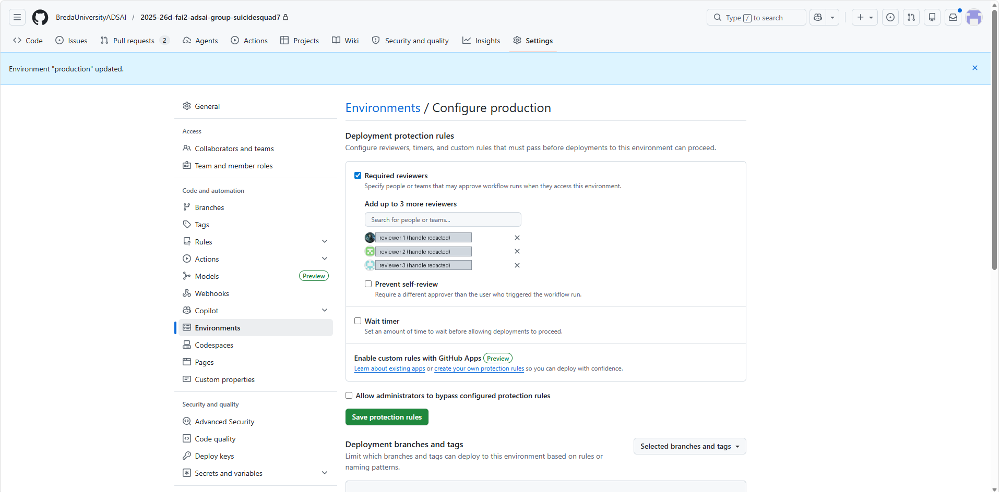
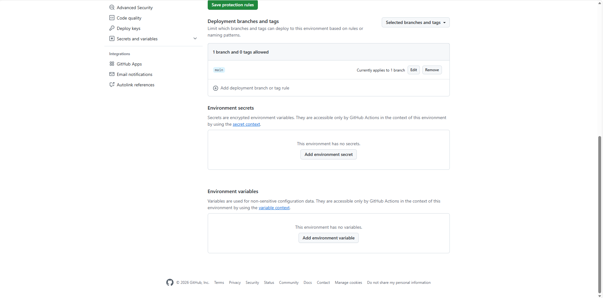

# The approval gate

A push to `main` builds and scans on its own. Getting from a scanned image to
production needed a person to say yes.

This was a GitHub Environment called `production` with deployment protection
rules on it. A job bound to that environment pauses before its first step and
waits, and the Actions run sits in "Waiting" until a required reviewer approves
or rejects it.

## What was actually configured

| Rule | State |
|---|---|
| Required reviewers | on, three configured |
| Prevent self-review | **off** |
| Wait timer | off |
| Allow administrators to bypass protection rules | off |
| Deployment branches | one branch allowed, `main`; no tags |
| Environment secrets / variables | none; everything came from repository scope |

Two of those are worth saying plainly rather than dressing up.

**Self-review prevention was left off.** With a five-person team and three
approvers, turning it on would have meant a deploy could stall whenever the
only available approver was the person who pushed. That is a defensible call
for a student project on a deadline and a bad one for anything real, where
separation of duties is the entire point of the gate. An earlier internal note
in the group repository claimed this setting was enabled. It was not, and the
screenshot above is why the claim is corrected here rather than repeated.

**Admin bypass was disabled**, which matters more than it sounds. Repository
admins could otherwise skip the gate entirely, and on a team where several
people hold admin, an optional gate is not a gate.

## Why the branch rule is not decoration

Restricting deploys to `main` is the same constraint the OIDC federated
credential enforces from the Azure side. Both are pinned to `main`, and so is
the workflow trigger. All three have to agree or the credential exchange fails;
see [`oidc-federated-auth.md`](oidc-federated-auth.md) for what goes wrong when
they do not.

## The wrinkle in the implementation

The gate is described here as the environment binding, because that is how it
was configured and approved. In the pipeline as it now stands, the Azure jobs
carry an explicit comment telling you *not* to add `environment: production`
back. Binding a job to an environment rewrites the OIDC subject claim from
`ref:refs/heads/main` to `environment:production`, and the credential was
registered against the ref form. Restoring the binding means re-registering the
credential on the Azure side first.

So the honest position: the approval gate and the federated credential were
both built, both worked, and reconciling the two required a choice that was
made in favour of the credential. Anyone re-deploying this against their own
subscription should register the credential against the environment subject
from the start and get both.
